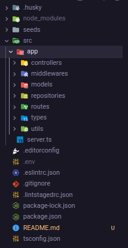

# Desafio Fábrica Startup

## 🚀 Principais tecnologias utilizadas

### <strong>Node.js</strong>
Ambiente de execução do javascript para construção de aplicações feitas para rodar no lado do servidor.

### <strong>Typescript</strong>
Linguagem criada para incrementar o poder ferramental do javascript adicionando algumas funcionalidades, dentre elas a possibilidade de tipar objetos e variáveis, sendo assim garantindo mais segurança na integridade do código no ambiente de desenvolvimento.

### <strong>Express.js</strong>
Micro framework javascript utilizado para a construção de APIs. De forma leve e pouco opinada, nos dá uma certa liberdade de construir de diversas formas recursos e endpoints que serão disponibilizado pela API construida. Sendo assim uma boa escolha para quem curte estas características numa tecnologia e consegue aproveitá-la da maneira mais adequada.

### <strong>Mongoose</strong>
Biblioteca mais famosa para a manipulação do banco NoSql MongoDb, onde têm-se a facilidade de construir "Documents" equivalentes a tabelas nos bancos relacionais, através de "Models", além disso disponibiliza métodos para busca e alteração de dados no banco trazendo facilidade para o desenvolvimento.

### <strong>Zod</strong>
Validador de tipos, ou seja, além haver a validação do typescript, com o zod têm-se uma camada a mais de validção dos tipos de dados das variáveis trazendo mais segurança na manipulação dos mesmos. Somando-se a funções por exemplo que não permitem um número ser negativo, ou então eliminar espaços no início e no fim das strings.

### <strong>JWT</strong>
Biblioteca relacionada ao padrão de autenticação mais utilizado para validação ou compartilhamento de informações, pois garante segurança durante estes processos.

### <strong>Docker</strong>
Ferramenta que dá a possibilidade de criar containers que rodam ambientes definidos nas suas configurações para cada container, na aplicação utilizei para iniciar o banco MongoDb.

## 🏛️ Arquitetura do projeto

 
Projeto construido em camadas, cada uma com a sua responsabilidade. Sendo elas:

### Controllers
É a camada que intermedia o processamento de dados na aplicação, recebendo os retornos da camada repositories para transmitir para o endpoint assim que finalizado o porcesso e ser consumido pelo cliente.

### Middlewares
Camada onde há funções que são executadas como intermédio para determinado fluxo, como no projeto foi criado para o fluxo de autenticação, a cada requisição aos endpoints abaixo desta função é verificado se há um token, se houver segue normalmente o fluxo da aplicação.

### Models
Camada que armazena a configuração de como é montado o modelo de dados de cada "tabela" do banco de dados.

### Repositories
Camada que se comunica com o banco de dados, sendo assim com intuito de somente manipular os dados do banco.

### Routes
Camada que armazena todos os endpoints da aplicação. Caminhos que serão consumidos pelo cliente a fim de enviar e receber dados.

### Types
Camada que armazena tipos customizados para determinados dados da aplicação.

### Utils
Camada que há funções úteis que podem se repetir no meio da aplicação. Por isso sendo extraídas para um arquivo e sem tornando-as reutilizáveis.

Por fim há arquivos de configuração pertinentes ao desenvolvimento da aplicação.

## ⚙️ Como executar o projeto

- Instalar o Node.js na sua máquina: `https://nodejs.org/en/`
- Instalar o Docker: `https://docs.docker.com/engine/install/`
- Abra o terminal e clone o projeto numa pasta de sua preferência: `git clone https://github.com/anacleto616/desafio-fabrica-startup.git`
- Entre na pasta desafio-fabrica-startup com: `cd desafio-fabrica-startup`
- Digite o comando: `npm install`, para instalar as dependências do projeto
- Digite o comando do docker para iniciar um container do banco de dados: `docker run --name mongo-api-fabrica -p 27017:27017 -d mongo`
- Crie um arquivo `.env` na raiz do projeto inserindo o seguinte conteúdo:
  - SECRET=09513b3b-d017-4b8d-be57-5df1f2bf0eaa
- Digite o comando: `npm run seed`, para fazer o seed do banco de dados
- Execute a aplicação com o comando: `npm run dev`, estará rodando no endereço: `http://localhost:3333`
